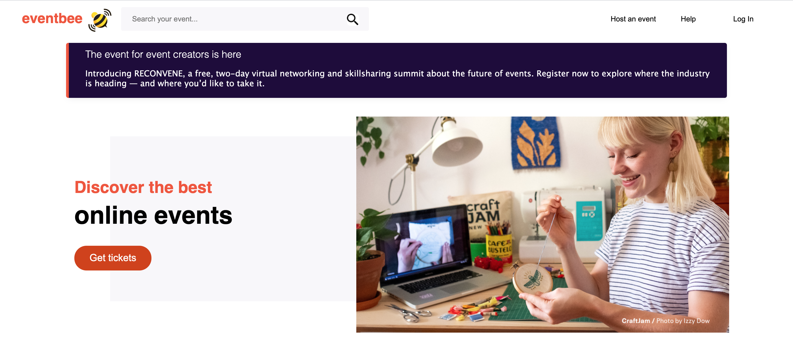
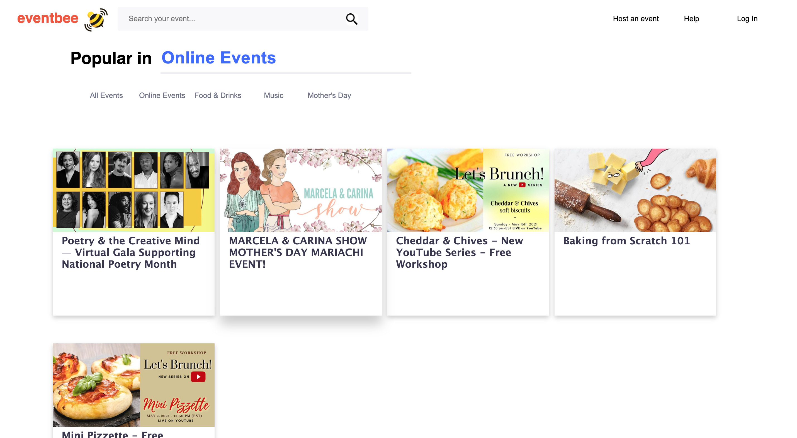
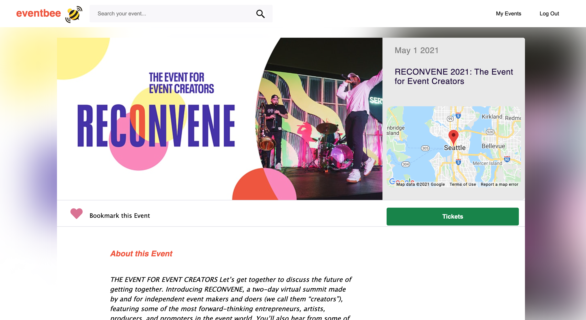
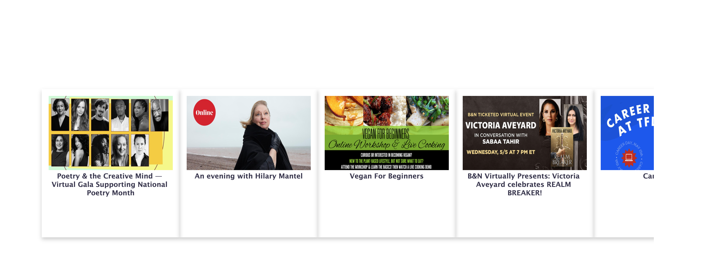
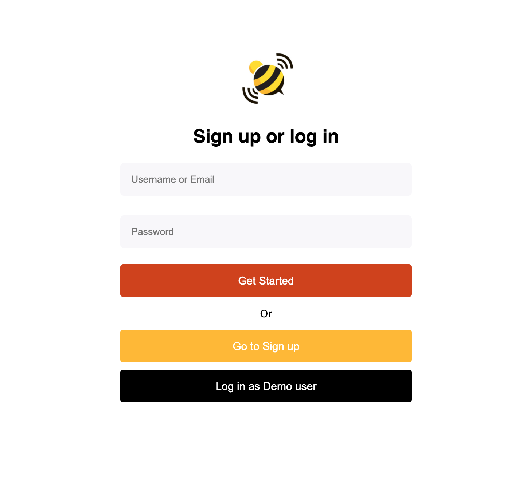
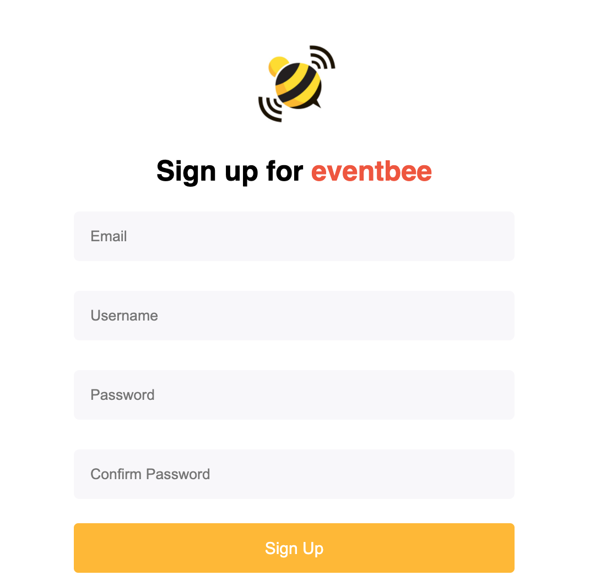
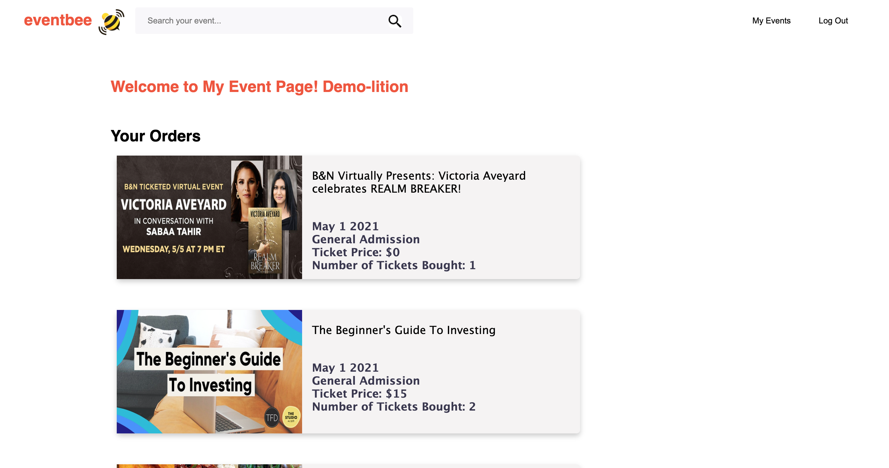
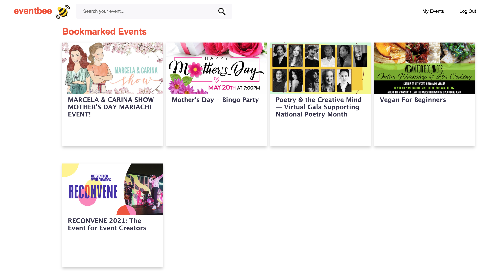
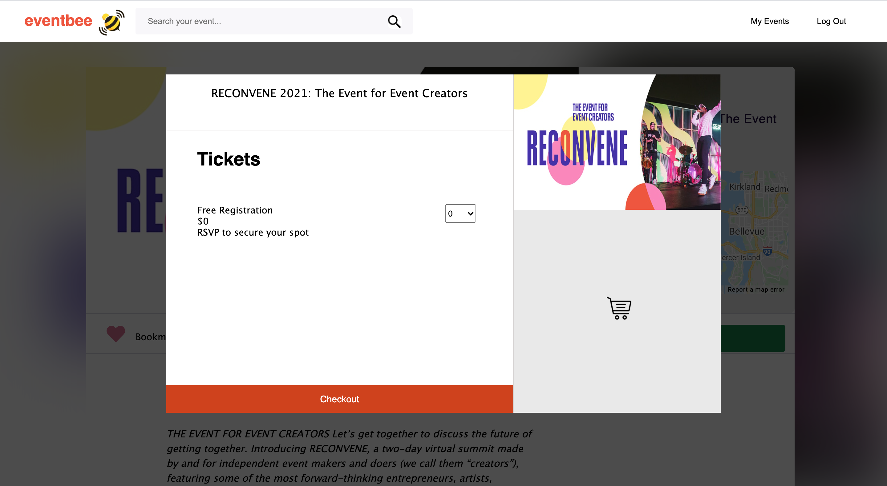

# Welcome to EventBee🐝
## Live Link: [Eventbee](https://event-bee.herokuapp.com/)

[Eventbee](https://event-bee.herokuapp.com/), a pixel perfect [Eventbrite](https://www.eventbrite.com/) clone, is a multi-page application that allows users to search events, purchase tickets and register for free events. Users can view browse, search for event by key words or different categories, bookmark their favorite events, and checkout their orders. 
#### Homepage

#### Homepage_Event Filter Function 

#### Event Page & Eventpage-Scroll

#### Login & Signup Page

#### Order List and Bookmark Page

#### Ticket Page

## Prerequisites
Please check out the following Wiki documents:
- [MVP List](https://github.com/QCHEN0407/ReactProject-EventBee/wiki/MVP-Feature-List)
- [Database Schema](https://github.com/QCHEN0407/ReactProject-EventBee/wiki/Database-Schema)
- [API Documents](https://github.com/QCHEN0407/ReactProject-EventBee/wiki/API-Documentation)
- [Frontend Routes](https://github.com/QCHEN0407/ReactProject-EventBee/wiki/Frontend-Routes)
- [React Components](https://github.com/QCHEN0407/ReactProject-EventBee/wiki/React-Components)

## Technologies used:
#### Backend
- Sequelize
- PostgresSQL
- express, express-validator
- csurf, dotenv, nodemon, cors, cookie-parser
- bcryptjs, jsonwebtoken

#### Frontend
- JavaScript,JSX
- HTML, Vanilla CSS
- React.js
- Redux
- Google Maps API
- react-icons, Font-Awsome

## Future Implementations
- Shopping cart for ticket purchase to show live price caculation 
- Host event function 
- Follow events creator function
- "Events for you" recommendation system 
- Bookmark button on every event card, unbookmark on MyEvent page
